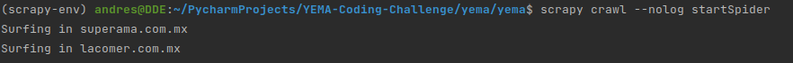
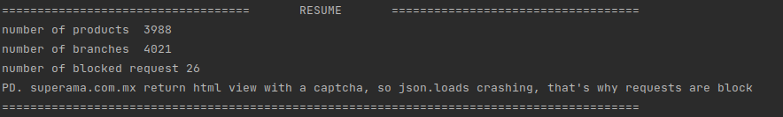
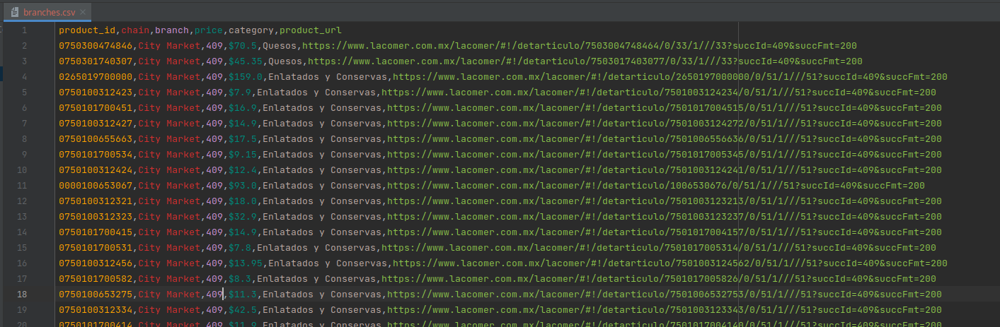
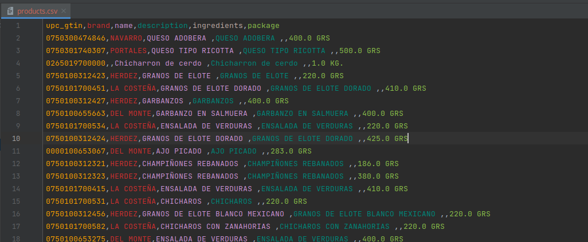

# YEMA-Coding-Challenge

Web crawler extract information (products & branches) from lacomercial.com.mx and superama.com.mx websites, 
after extracted and processed the information is saved as csv files.

**Install**

`pip install -r requirements.txt`

**Use**

`scrapy crawl --nolog startSpider`

`Example`

